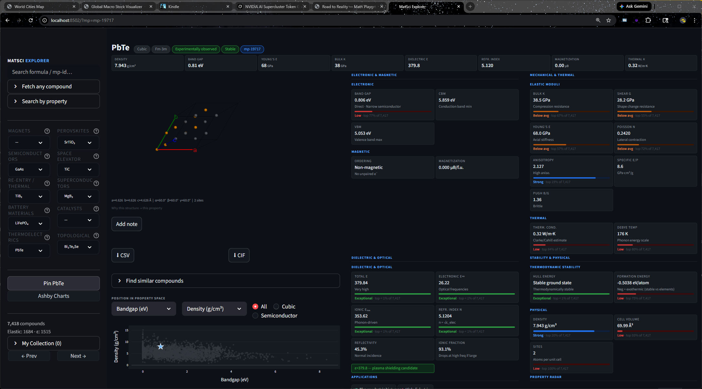

# MatSci Explorer

A personal materials science learning dashboard connecting crystal structure to material properties.
Built with Streamlit, the Materials Project API, and pymatgen.



---

## What it does

MatSci Explorer lets you browse 25+ curated compounds across 10 material categories, visualize their crystal structures in 3D, explore key physical properties, compare compounds side by side, and understand *why* a material's structure determines its behavior — with plain-English explanations everywhere you hover.

**Categories:** Strong Magnets · Perovskites · Semiconductors · Space Elevator · Re-entry / Thermal · Superconductors · Battery Materials · Catalysts · Thermoelectrics · Topological Insulators

---

## Features

### Crystal Viewer
- Interactive 3D rotating structure (py3Dmol, WebGL) with accent-colored unit cell outline
- Smart supercell expansion — shows at least 2 periods in every axis so layered materials (e.g. Bi₂Te₂Se) render properly instead of as isolated slabs
- Lattice parameters (a, b, c, α, β, γ) and site count below the viewer
- "Why this structure → this property" hover popup per compound

### Property Panels (2×2 grid)
- **Electronic & Magnetic** — band gap, direct/indirect, CBM/VBM, magnetization, magnetic ordering
- **Mechanical & Thermal** — Young's modulus, bulk/shear modulus, Poisson ratio, anisotropy, Debye temperature, thermal conductivity
- **Dielectric & Optical** — total/ionic/electronic dielectric constant, refractive index, reflectivity, ionic fraction
- **Stability & Physical** — hull energy, formation energy, density, volume, ICSD IDs
- Every property label has a rich hover tooltip with a colored scale and plain-English description
- Rank bars on every card — 5-tier system (Exceptional / Strong / Average / Below avg / Low) vs 6,800+ Materials Project compounds

### Universal Hover Tooltips
Every element in the app explains itself on hover:
- **Badges** (crystal system, space group, stability, experimental vs computational) — what each means, with example compounds and physical intuition
- **KPI strip** (Density, Band Gap, Young's E, Bulk K, Dielectric ε, Refr. Index, Magnetization, Thermal κ) — plain-English definition + real-world reference values
- **Section headers** — what data source and calculation method produced that section's data
- **Sub-headers** (Electronic, Magnetic, Elastic Moduli, etc.) — method details (DFT, DFPT, Hill average, etc.)
- **Sidebar category dropdowns** — why this material category matters and what properties make it interesting

### Navigation
- Sidebar 2-column category dropdown grid for fast compound switching
- Full-text search by formula or mp-id
- Property filter expander — narrow by bandgap, density, Young's modulus, magnetization, and more
- Browser back/forward support — URL query param `?mp=mp-xxxx` updated on every navigation
- Prev / Next buttons to step through curated compounds in order
- Click any point in the position chart to navigate directly to that compound
- "Fetch any compound" — enter any mp-id to load it from the Materials Project API on demand

### Comparison Mode
- Pin a compound, then pick a second — side-by-side 3D viewers, mirrored XRD overlay, color-coded delta table

### Ashby Charts
- Scatter any two properties against each other; color by crystal system, magnetic ordering, or theoretical flag

### Find Similar
- Nearest-neighbor search in 6-property space across all ~6,800 compounds in the local DB
- Click any result to navigate directly to it

### Applications Badges
- Rule-based application tags (Solar cell, Permanent magnet, Li-ion cathode, Superconductor, etc.) derived from computed properties

### Property Radar
- Normalized spider chart comparing the selected compound to the database min/max
- Shows pinned comparison compound as a second trace if one is pinned

### ML Band Gap Prediction
- GradientBoostingRegressor trained on the local database (structural + compositional features only)
- Shows predicted vs actual (DFT) band gap, error, and feature importance bars
- Model is trained once per session and cached

### XRD Patterns
- Simulated Cu Kα powder diffraction (pymatgen `XRDCalculator`)

### DOS + Band Structure (on demand)
- Density of states and band structure fetched from the Materials Project API on demand
- Cached in SQLite after first fetch — no repeated API calls

### Parallel Coordinates Explorer
- Multi-property comparison across all compounds — each polyline is one compound
- Scroll to zoom, hover any line for compound name and property values
- Current compound highlighted in accent color
- Axis selection via multiselect

### Notes
- "Add note" button per compound — write and save personal observations in SQLite

### My Collection
- Save compounds to a personal collection; browse them in the sidebar

### Wikipedia Integration
- Plain-language summary and external link fetched from Wikipedia and cached locally

---

## Installation

**Prerequisites:** Python 3.11+, a free [Materials Project API key](https://materialsproject.org/api)

```bash
# 1. Clone / download the project folder
cd kmatsci040226

# 2. Install dependencies
pip install streamlit mp-api pymatgen plotly python-dotenv requests scikit-learn

# 3. Create a .env file with your API key
echo MP_API_KEY=your_key_here > .env

# 4. Populate the local database (one-time, ~10–30 min depending on fetch size)
python fetch.py

# 5. Launch the dashboard
streamlit run app.py
```

The app runs entirely from `matsci.db` after the first fetch — no live API calls are needed to browse cached compounds. On-demand features (DOS, band structure, fetching new mp-ids) require an API key.

---

## Project structure

```
kmatsci040226/
├── app.py           # Streamlit dashboard (UI, charts, dialogs)
├── compounds.py     # Curated compound catalog with mp_ids and explanations
├── db.py            # SQLite database layer (schema, queries, migrations)
├── fetch.py         # One-time bulk fetcher from Materials Project API
├── predict.py       # ML band gap prediction (GradientBoostingRegressor)
├── pubchem.py       # PubChem cross-reference for experimental properties
├── wikipedia.py     # Wikipedia summary fetcher with local cache
├── matsci.db        # SQLite database (auto-created by fetch.py)
├── cache/           # JSON cache for structures and Wikipedia pages
└── .env             # API key (MP_API_KEY=...)
```

---

## Running fetch.py

```bash
python fetch.py
```

Runs five sequential steps:

1. **Curated IDs** — fetches the hand-picked compounds by exact mp-id
2. **Category sweeps** — bulk-fetches magnets, semiconductors, and perovskites by property filters
3. **Extended field refresh** — fills in missing CBM/VBM/ordering fields for existing records
4. **Elasticity** — fetches mechanical data from the MP elasticity endpoint
5. **Dielectric** — fetches optical/dielectric data

After step 1 completes you can already run the app. Steps 4–5 can take 30–60 minutes for a large database.

---

## Dependencies

| Package | Purpose |
|---------|---------|
| `streamlit` | Web UI framework |
| `mp-api` | Materials Project Python client |
| `pymatgen` | Crystal structure parsing, XRD simulation |
| `plotly` | Interactive charts (Ashby, XRD, radar, parallel coords) |
| `python-dotenv` | Load `MP_API_KEY` from `.env` file |
| `scikit-learn` | ML band gap prediction model |
| `requests` | PubChem REST API calls |
| `sqlite3` | Built-in Python — local database (no install needed) |

---

## Data sources

- **[Materials Project](https://materialsproject.org)** — DFT-computed crystal structures, electronic, mechanical, and dielectric properties. Requires a free API key.
- **[PubChem](https://pubchem.ncbi.nlm.nih.gov)** — Open chemistry database with experimentally measured thermal and chemical properties. No key required.
- **[Wikipedia](https://en.wikipedia.org)** — REST v1 summary API for compound background text. No key required.

---

## What's next

MatSci Explorer is feature-complete as a learning demo. The natural evolution is to make it an **AI-driven materials intelligence platform** — not just a viewer, but an active research assistant.

### Agentic data expansion

The app currently pulls from three sources (Materials Project, PubChem, Wikipedia). Future sources worth integrating:

| Source | What it adds |
|--------|-------------|
| [AFLOW](http://aflowlib.org) | 3M+ compounds, high-throughput DFT, hardness data |
| [OQMD](https://oqmd.org) | Alternative DFT energetics for cross-validation |
| [COD](https://www.crystallography.net) | Experimental crystal structures (not just computed) |
| [Springer Materials](https://materials.springer.com) | Experimental thermal/optical/electrical measurements |
| [ICSD](https://icsd.fiz-karlsruhe.de) | Full experimental structure database |

An agentic AI workflow (Claude + tool use) could handle this automatically:

1. **Ingest** — query each API, normalize fields into the existing SQLite schema
2. **Deduplicate** — match compounds across sources by formula + space group, merge best values
3. **Score candidates** — rank by data completeness, novelty vs existing collection, and structural diversity
4. **Profile for applications** — given a target spec (e.g. "lightweight structural material for re-entry, κ < 10 W/m·K, E > 200 GPa"), the agent searches the full DB, filters, and returns a ranked shortlist with plain-English rationale
5. **Generate explanations** — prompt the LLM to write "why this structure → this property" narratives for newly added compounds (same format as `compounds.py`)
6. **Validate & insert** — verify the mp-id resolves, load the 3D structure, and write the new entry into `compounds.py`

The recipe for step 5–6 is already documented in `compounds.py`.

### Modeling and candidate profiling ideas

- **Beyond band gap** — extend `predict.py` to predict Young's modulus, thermal conductivity, and formation energy using the same structural features + graph neural network embeddings (e.g. MEGNet, CGCNN via `matgl`)
- **Inverse design** — given target property ranges, use the local DB as a training set for a generative model that proposes new compositions
- **Uncertainty quantification** — add prediction confidence intervals so the radar chart shows not just the predicted value but how reliable the model is for that compound class
- **Multi-objective Pareto front** — Ashby charts extended to highlight the Pareto-optimal materials for any two competing properties (e.g. stiffest AND lightest)

---

## License

Personal learning project — not intended for production or commercial use.
